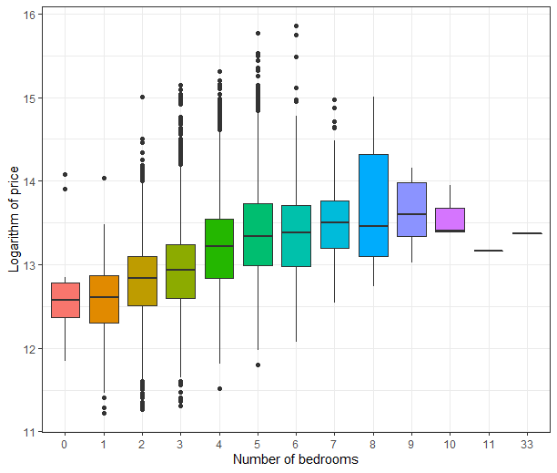
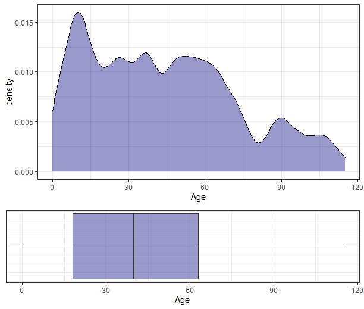
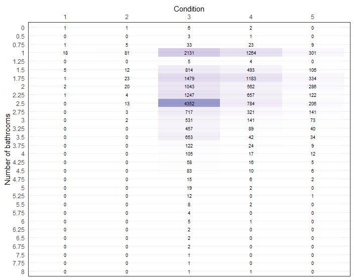

## Analysis of House Sales Prices Dataset

## House Sales Prices Datset

The following analysis has been prepared on a data collection describing the sale of houses (House Sales Prices). Below is a list of variables:

## Variables

- `bedrooms` number of bedrooms
- `bathrooms` number of bathrooms, where .5 accounts for a room with a toilet but no shower
- `floors` number of floors
- `waterfront` apartment was overlooking the waterfront or not
- `view` how good the view of the property was
- `condition` condition of the apartment
- `grade` level of construction and design
- `zipcode` zipcode area
- `lat` lattitude
- `long` longitude
- `dist_stop` the distance from public transport 
- `ncult` number of cultural facilities within a kilometre radius
- `age` age of house
- `since_renovated` number of age from the house's last renovation
- `m2_living` square meter of the apartments interior living space
- `m2_lot` square meter of the land space
- `m2_above` the square meter of the interior housing space that is above ground level
- `m2_basement` the square meter of the interior housing space that is below ground level
- `m2_living15` the square meter of interior housing living space for the nearest 15 neighbors
- `m2_lot15` the square meter of the land lots of the nearest 15 neighbors
- `price_log` logarithm of price of each home sold   

### Logarithm of price

Below is a density and boxplot plot describing the variable `price_log`. 

### Relationship between logarithm of price  and other variables

#### Number of bedrooms

#### Number of bathrooms

#### Number of floor

#### Condition

#### Grade

#### Year of construction

#### Construction year for property below 1 million

#### View

### Other dependencies

### Table 

#### Number of bedrooms vs number of bathrooms

#### Condition vs number of bathrooms

#### Condition vs number of bathrooms 

#### Waterfront vs condition

#### Condition vs Grade

#### Number of bedrooms vs grade

#### Number of bathrooms vs grade

