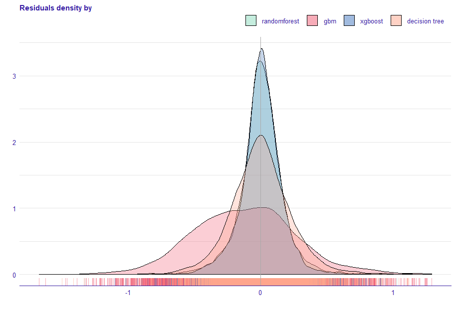
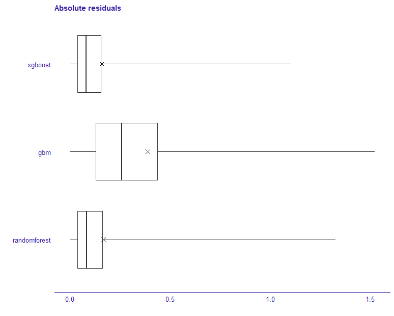

## Model assessment

### Verification, validation, and error analysis with [auditor](https://cran.r-project.org/web/packages/auditor/index.html) R package

| Model     |  RMSE train | RMSE test | Parameters|
|-----------|------------|-----------|-----------|
| random forest|  0.07931109|0.1674559| `mtry` = 4, `num.trees` = 476, `min.node.size` = 6|
|gbm|0.3924759|0.3904789|`n.trees` = 847, `interaction.depth` = 5|
|xgboost|0.1076962 |0.1600113 | `nrouds` = 246,  `max_depth` = 6, `eta` = 0.106,  `lambda` = 0.608|
|decision tree|0.2285688|0.2329774|`minsplit` = 26, `minbucket` = 5, `cp` = 0.00152|
|xgboost one-hot|0.1207626|0.1595913 |`nrouds` = 468, `max_depth` = 4, `eta` = 0.134, `lambda` = 0.763|
|gbm one-hot|0.1302585 | 0.1607376 | `n.trees` = 898, `interaction.depth` = 6|
|random forest one-hot|0.1713819|0.2022199|`num.trees` = 155, `mtry` = 4, `min.node.size` = 1|
|decision tree one-hot|0.3097931|0.2995141|`minsplit` = 35, `minbucket` = 9, `cp` = 0.0167|
|lm |0.1829931 |0.1857949|-|

###  Residuals

