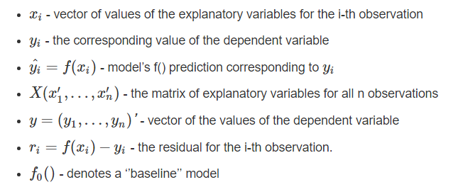
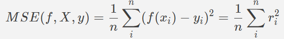
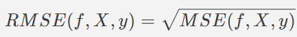
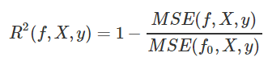
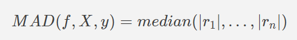
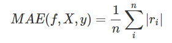
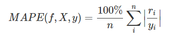

##  Model Assessment Methods

### Notation  

#### * *MSE (Mean Square Error)*

#### * *RMSE (Root Mean Square Error)*

#### * *R^2 (Coefficient of determination)*

#### * *MAD (Median Absolute Deviation)*

*MAD* is more resistant to outliers than *MSE*.

#### * *MAE (Mean Absolute Error)*

#### * *MAPE (Mean absolute percentage error)*

