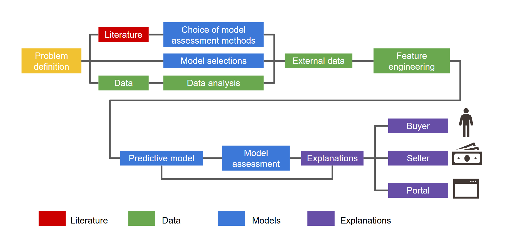

# Interpretable House Sale Prices 
Machine Learning models and XAI on House Sale Prices data

This repository is a collection of codes and results obtained within the student project for [Interpretable Machine Learning](https://github.com/pbiecek/InterpretableMachineLearning2020) course at the University of Warsaw and the Warsaw University of Technology. The project is focused on case study for selected XAI technique. More about this project [here](https://pbiecek.github.io/xai_stories/).

We have divided our work into several stages, below we present a diagram with a step plan. Each color represent a catalog in this repository.

### Literature 
- [Papers](https://github.com/kozaka93/InterpretableHouseSalePrices/tree/master/Literature)
### Data
- [Data analysis](https://github.com/kozaka93/InterpretableHouseSalePrices/tree/master/Data)
- [External data](https://github.com/kozaka93/InterpretableHouseSalePrices/tree/master/Data)
### Models
- Model assessment methods
- Model selection
- Predictive models
- Model assessment
### Explanations
- Buyer
- Seller
- Portal
