# Story House Sale Prices: eXplainable predictions for house sale {#story-house_sale_prices}

*Authors: Piotr Grązka (SGH Warsaw School of Economics), Anna Kozak (Warsaw University of Technology), Paweł Wicherek (Warsaw University of Technology)*

*Mentors: Mateusz Zawisza (McKinsey & Company), Adam Zmaczyński (McKinsey & Company)*

> ''That's all your house is: it's a place to keep your stuff while you go out and get more stuff.''
>  `r tufte::quote_footer('George Carlin')`


## Introduction 

Everybody needs a roof over their heads. It can be a house, villa, or a flat. Everybody, at some point in life, faces a choice if to buy a house. If so, which one. And why they are so expensive?

The topic of real estate is not only the topic you just have to deal with. It can also be very interesting. There are plenty of TV Shows, for instance, *Property Brothers*, of which plot is based on examples of people buying and renovating houses. This particular one is the most famous in the world and has been running already for almost a decade. 
For many people houses are also products to buy and sell with income.

Regardless of motives of buy/sell real estate, both sides agree to a price. It is always good to know, **how much** it is worth, what's the fair/true value. And, maybe it's even more important, **why** the price is like that, what has an influence on it.

In this work we want to try to find an answer to both questions with a stronger emphasis on the second one. This paper is intended to be a complete use case on how to deal with the regression problem for Data Scientists. Let's start with a couple of questions that will allow us to understand and define the problems

- *The seller does not know how to increase the cost of the apartment so that the investment outlay is lower than the added value (e.g. building a pool will increase the price and renovating the bathroom is not worth it).*

- *The seller does not know how much to sell the apartment for (he makes an offer on the portal and does not know if the price is fair).*

- *The buyer does not know how much the apartment is worth (as above, whether the price is fair).*

- *Commercial problem: Auction services do not have tools to support sellers/buyers.*

These are just some of the questions we can ask. As a definition of our problem, we have set ourselves a property valuation, and thorough explanations we will try to get an answer depending on the position we choose.


We have divided our work into several stages, below we present a diagram (Figure \@ref(fig:plan)) with a step plan. It allowed us to plan our work, and now we will use it to tell you what we did.


```{r plan, out.width="700", fig.align="center", echo=FALSE, fig.cap='A scheme with a step-by-step plan that allowed us to plan our work.'}
knitr::include_graphics('images/02-plan.png')
```

We started our work with a literature review. Many papers show a comparison of hedonistic models (linear regression) and machine learning models. Below is a graph with results achieved by models that can be interpreted by design (hedonistic) and black box model (ANN) based on the article [@house_prices].


```{r paper-plot, out.width="600", fig.align="center", echo=FALSE, fig.cap='Comparison of the performance of hedonic regression model and ANN(artificial neural networks).'}
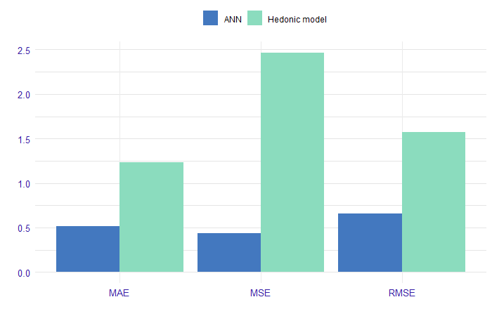
```

We can conclude from Figure \@ref(fig:paper-plot) that we reduce the interpretability to an increase in the quality of model fitting.

The next point was data analysis, we work on a dataset which contains house sale prices for King County, which includes Seattle. It is include homes sold between May 2014 and May 2015. Data available on [kaggle](https://www.kaggle.com/harlfoxem/housesalesprediction) and [openml](https://www.openml.org/d/42079).
We have analyzed the data, [more](https://github.com/kozaka93/InterpretableHouseSalePrices/tree/master/Data/DataAnalysis). Data contains 19 house features plus the price and the id columns, along with 21613 observations. 


|Variable | Description|
|---------|------------|
|`id`| unique ID for each home sold|
|`date`| date of the home sale|
|`price`| price of each home sold|
|`bedrooms`| number of bedrooms|
|`bathrooms`| number of bathrooms, where .5 accounts for a room with a toilet but no shower|
|`sqft_living`| square footage of the apartments interior living space|
|`sqft_lot`| square footage of the land space|
|`floors`| number of floors|
|`waterfront`| apartment was overlooking the waterfront or not|
|`view`| how good the view of the property was|
|`condition`| condition of the apartment|
|`grade`| level of construction and design|
|`sqft_above`| the square footage of the interior housing space that is above ground level|
|`sqft_basement`| the square footage of the interior housing space that is below ground level|
|`yr_built`| the year the house was initially built|
|`yr_renovated`| the year of the house's last renovation|
|`zipcode`| zipcode area|
|`lat`| lattitude|
|`long`| longitude|
|`sqft_living15`| the square footage of interior housing living space for the nearest 15 neighbors|
|`sqft_lot15`| the square footage of the land lots of the nearest 15 neighbors|

Table: Description of variables in the dataset.

We have collected methods to evaluate the performance of the regression model, we decided to use RMSE (root mean square errors).

Based on the literature we decided to test the following models:

- linear regression

- fixed effects model

- random effects model

- decision tree

- random forest

- gradient boosting

- xgboost

Another idea of how to enrich our solution was to add external data. The location of the property can significantly affect the price, so we also took into account the distance from public transport and the number of cultural facilities within a kilometer radius.


## Data preperation
Original data from kaggle is in good quality at the start, but we need to preprocess it to suit our needs. In this section we want to describe how we prepared ready-to-use `csv`s of the train and test data ([`train.csv`](https://github.com/kozaka93/InterpretableHouseSalePrices/blob/master/Data/TrainAndTest/test.csv), [`test.csv`](https://github.com/kozaka93/InterpretableHouseSalePrices/blob/master/Data/TrainAndTest/train.csv)). This includes variable transformations, joining external data, records processing.

Firstly, we discovered that there are houses that were sold twice, and one house that was sold three times. One can assume, that it was bought, renovated and then sold for more. But they have the same explanatory variables, no changes. Each pair (triple) of houses we decide to aggregate into a single row with averaging the price. 

Secondly, we decided to add external data. Why? We believe most variables describe the house properly. What we are missing is some spatial information. Except zip code, we have longitude and latitude -- good, that'd be helpful -- but we want to explain it more. Why some locations tend to be more expensive? Maybe it's because of public transport availability. That's why we decided to add a variable describing a distance to the nearest bus/subway stop. Data source can be found [here](https://www.kingcounty.gov/depts/transportation/metro/travel-options/bus/app-center/developer-resources.aspx).

There might be also another reason. Maybe some houses are more expensive, because of some interesting places around, like museums, galleries or fine restaurants. We'll call them *cultural places*. Those places are not only standalone facilities, but they are connected to other infrastructure, which generally should increase the price. This time we decided to look in the neighborhood: we search for a number of such places in arbitrarily chosen 1km range. Data obtained from [here](https://data.seattle.gov/Community/Seattle-Cultural-Space-Inventory/vsxr-aydq).

```{r house-stops-cult, out.width="600", fig.align="center", echo=FALSE, fig.cap='Spatial external data. Stops on the left and cultural places on the right.'}
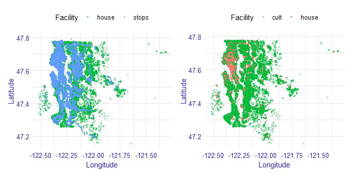
```


Both of these external data we visualize at the figure \@ref(fig:house-stops-cult). At this point it is also worth a comment. Let us begin with the latter. Most of them, not all, are concentrated in the city centre. So this column also tells some story  *how much of the city center does this house have*. Since not all of those places are in the city center, then those other points should reflect some *local centers*.  

Public transport stops are very dense in the city center, so they even cover house dots on the plot. Outside of the city center, one can also notice buses routes. It is quite clear, that not every house has good connection to public transport. That'd force parents to drive their children where they need to. For some people it would be kind of an obstacle, so they would rather more sceptical about that particular house, thus reducing demand of that house, which should lower the price.


We also did several variable transformations. Since for authors it is hard to think in square feet, we translate it into square meters. `zipcode` and `waterfront` are saved as factors. Further, for us it's easier for us to interpret the age of a building rather than a year when it was built. We also know, if and when a house has been renovated. We can also analyze *relative age*, that is the time which has past since last renovation (variable `since_renovated`). Here we also log the price, since we want to work on a relative scale.

The last step is division the data into train and test samples randomly with ratio 70/30.

Ready script for processing the original data from kaggle is on the github. For spatial data analysis, we were using a short script [`geofast`](https://github.com/kozaka93/InterpretableHouseSalePrices/blob/master/Data/TrainAndTest/geofast.py). Distances between two arbitrary points on earth can be obtained from the [@geopy] package for Python. However, general and precise formula is computationally expensive. With a simple trick, it can be adjusted to our case without losing almost any precision. This can be done by providing distances to measure are not exceeding several hundred kilometers. The original idea was published [here](https://blog.mapbox.com/fast-geodesic-approximations-with-cheap-ruler-106f229ad016).


## Model 

Inspired by literature, we started our analysis by building a white-box linear model. The aim was not to build an ideal model, but rather to get an insight into the relationships in the data and to have a point of reference for more complex models performance and interpretations.
Based on economic interpretation, we chose logarithm of price as the dependent variable. The continuous variables characterizing areas were also logarithmized.  Variables referring to latitude and longitude were omitted since they are unlikely to have a linear effect on price. Instead, zip codes were used to model geographical effects. To avoid collinearity with years since renovation variable, age variable was omitted.

This model ignores information about house location almost completely (part of this information is carried only by variables such as distance to the nearest bus stop). It assumes that the price of a house in the city centre is driven by the same effects as the price of a house in the suburbs. One could argue that this assumption is almost never true, and instead, the data should be modelled by the panel or spatial techniques.
Taking this into consideration, we developed a second model that allows for prices of houses belonging in different zip codes to have their own intercept. The underlying assumption is that the closest area of houses will have a *fixed effect* on their price. It is the same model as before but with new binary variables (in number equal to a number of zip codes - in our case: 70) indicating whether a house belongs to a certain zipcode or not.

A neighbourhood, however, can also have an impact on the effect of the particular variables on price. Increasing an area of a house can have a different impact on its price, depending whether the house is located in the city centre, or in the suburbs. The final model takes this argument into consideration, allowing for houses in different zip codes to have different slopes coefficients for certain variables. Technically, those differences are modelled as *random* deviations from the general effects.

The choice of variables that include random effect was made arbitrarily, to reduce the complexity of the problem. Only variables for which a random deviation of their impact could be easily interpreted were chosen (e. g. `view` importance can vary between geographical locations, since the views themselves are different).

We are aware that one could find different approaches that could better fit the data. However, since our scope was not to maximize fit, and no further analysis yielded considerably different results, we decided to limit the consideration to the three models presented.

Estimated coefficients are presented in the table below. Since the dependent variable is the logarithm of price, the coefficients have an interpretation of a percentage change. 
Looking at the estimates, a couple of general observations can be made. Firstly, there are no major differences in the coefficients between models, especially between (2) and (3). This tells us that the models can be considered stable. Basing on RMSE, we should note a significant improvement of fit resulting from introducing zip code-based fixed effects in the model (2). A slight, but noticeable improvement was also made by allowing for coefficients to have a random effects in the model (3). These observations suggest that our hypothesis about neighbourhood having a significant impact on a house price, but also about particular variables’ effect on price, was reasonable.

| Model | Log-loglinear (1) | Zipcode-based intercepts (2) |Random effects (3)|
|--|:--:|:--:|:--:|
|(Intercept)  | 8.1531 | | 8.8260(RE) |
|bedrooms|-0.0304|-0.0096|-0.0079 |
|bathrooms|0.0579|0.0409|0.0379|
|floors|0.0293|-0.0339|-0.0186|
|waterfront|0.4605|0.5208|0.4641(RE)|
|view|0.0559|0.0609|0.0543(RE)|
|condition|0.0495|0.0557|0.0586|
|grade|0.1886|0.0885|0.0876|
|dist_stop_km|-0.0106|-0.0041|-0.0047|
|ncult|0.0134|0.0016|0.0026|
|since_renovated|0.0038|-0.0002|-0.0007|
|m_2_lot_log|0.0043|0.0727|0.0841(RE)|
|m_2_above_log|0.3257|0.4099|0.3844(RE)|
|m_2_basement_log|0.0446|0.0270|0.0271|
|m_2_living_15_log|0.2877|0.1729|0.1566(RE)|
|m_2_lot_15_log|-0.0314|-0.0126|(RE)|
|RMSE(train)|0.3054|0.1797|0.1707|
|RMSE(test)|0.3061|0.1801|0.1762|

Table: Estimated coefficients for linear models.


Estimated coefficients can be interpreted rather intuitively. It is not surprising that the area of the house has a considerable positive impact on price. The same can be said about variables characterizing the quality of the property (`grade`, `condition`) and its surroundings (`view`, `waterfront`). Especially we can note how important access to the waterfront is in Seattle, that is related to the city geography. Since it is more convenient to have more bathrooms in the house, `bathrooms` coefficient is also positive. Higher distance to bus stop results in a slight decrease in house value, which again is correct with intuitive expectations. Number of floors, which impact is also negative, can be associated with lower convenience. One may be wondering why years passing since the last renovation do not have a great impact on price. It can be explained by the fact that we already include variables characterizing the condition of the building, and with those being constant – years become not much more than number.

To further assess the model performance, we may take a look into the residual density (Figure\@ref(fig:resid-lm-density)). Most of the residuals being in (-0,5; 0,5) range means our model makes the biggest error of approximate -40% and +66%.


```{r resid-lm-density, out.width="700", fig.align="center", echo=FALSE, fig.cap='Residuals density for random effects (3) model.'}
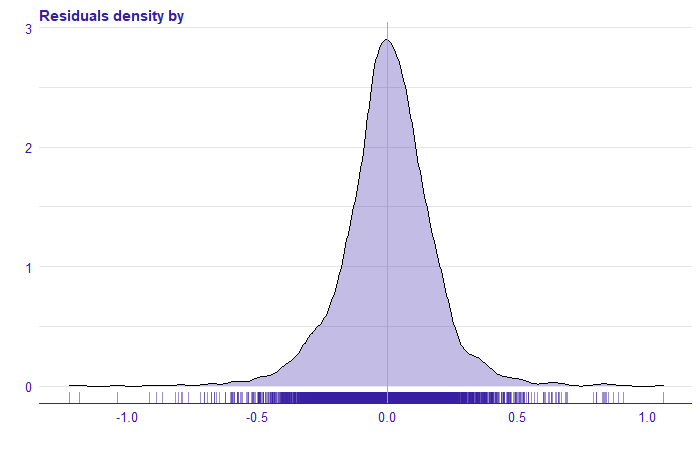
```

Plotting residuals against explained variable gives us some more insight into what happened in the model.

```{r resid-lm-scatter, out.width="700", fig.align="center", echo=FALSE, fig.cap='Plot the residual for the random effect model. The residuals correspond to the difference between the value of the target variable and the prediction from the model. On the x-axis we have the value of the target variable (price logarithm), on the y-axis of the residual, each point corresponds to the observation from the test set.'}
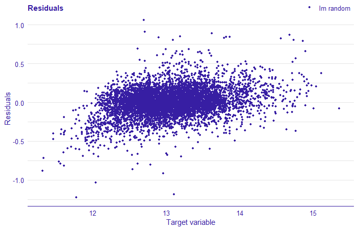
```

We can note a lot of points being in the lower left part of the plot. This tells us that the model overestimated prices of low-valued houses. The residuals cannot be considered normally distributed.
Overall, the model gave us numerous insights and reasonable predictions. It is, however, far from being perfect. The analysis of residuals clearly suggests that there are some other effects in the data that we failed to model with linear regression. These may result from too few variables being taken into consideration, or, what is more interesting for us in this work – from the relationships in data being complex and non-linear. In the following sections, we focus on machine learning models, that can perform better in complex environments.


Our main goal, as we mentioned before, is to explain the model of choice.  Along self-explanatory linear models included as comparison, we considered models including: 

- decision tree

- random forest

- gradient boosting

- xgboost.

As mentioned earlier, the variables `zipcode` and `waterfront` were introduced as categorical. These models were built. Additionally, for the `zipcode` variable, which has 70 levels, we use one-hot encoding and build models again. The models are built in `mlr` [@mlr] R package with `ranger` [@ranger], `gbm` [@gbm], `xgboost` [@XGBoost] and `rpart` [@rpart].

For the models the RMSE score was calculated on the training and test set using the R `auditor` [@auditor] package., the results were presented in the Figure \@ref(fig:rmse-train-test). The smallest RMSE has a random forest model, xgboost, xgboost with one-hot encoding, and gbm with one-hot encoding. Other models have a much bigger error. So let's take a look at these four models. 

```{r rmse-train-test, out.width="700", fig.align="center", echo=FALSE, fig.cap='Comparison of model performance by RMSE on training and test set. In the plot the trained models are marked with points, on the x-axis we have RMSE measure for the training set, on the y-axis the RMSE score for the test set, the line stands for RMSE equal on training and test sets'}
knitr::include_graphics('images/02-rmse-train-test.png')
```


|Model |RMSE train | RMSE test |
|------|:---------:|:---------:|
|random forest | 0.07931109 |	0.1674559 |
|xgboost |	0.1076962 |	0.1600113|


Table: Model results on the training and test set.

By analyzing the received models we obtained the following results. The random forest model is overfitted, while the xgboost model is a little better. On the test set they obtained similar scores. The Figure \@ref(fig:residual-1) shows the density of the residuals, for both models. We see that the xgboost model has larger residuals than the random forest model.

```{r residual-1, out.width="700", fig.align="center", echo=FALSE, fig.cap='Residuals density for random forest and xgboost models.'}
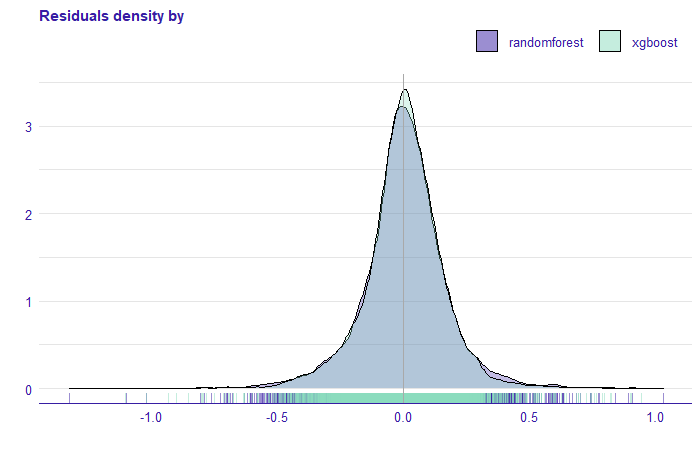
```


Comparing the xgboost model with one-hot encoding and gbm with one-hot encoding we see that the RMSE score on the training and test set is very similar. Furthermore, the residual density plot (Figure \@ref(fig:residual-2) ) is practically identical. 

|Model |RMSE train | RMSE test |
|------|:---------:|:---------:|
|xgboost one-hot |	0.1207626 |	0.1595913|
|gbm one-hot |	0.1302585 |	0.1607376 |


Table: Model results on the training and test set with one-hot encoding.

```{r residual-2, out.width="700", fig.align="center", echo=FALSE, fig.cap='Residuals density for gbm and xgboost models.'}
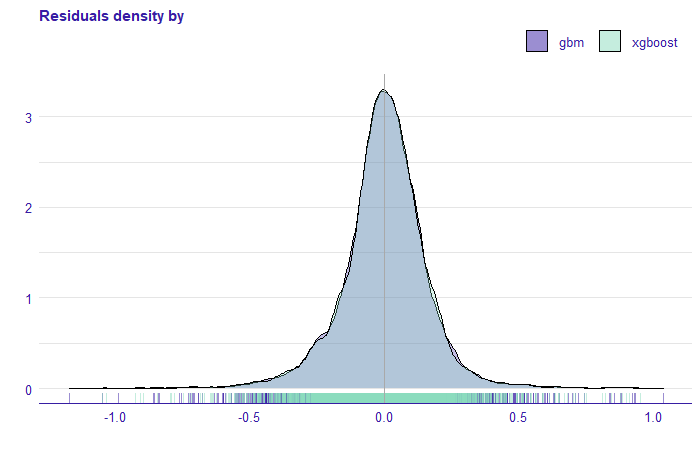
```

## Explanations


In this chapter we will present the methods of explainable machine learning models. They allow us to understand the compiled models. Following the plan from the Figure \@ref(fig:plan), we will show the explanations for the three groups (seller, buyer, and ad portal), but before we do that, we will continue the analytical approach to the regression problem and show how to apply XAI methods in model evaluation. Before applications, we want to understand how these models work. At the beginning we'll start explaining four of them, dropping some along the way.    

### XAI GPS

Generally, we want to approach _explanations_ by discovering them. As we write this chapter, there are some ideas how to organize the explainable machine learning workflow, but it is more or less in alpha version. We want to explore XAI tools by playing with them. We predict, that we'll face some dead ends on the way, but that's also informative: one can learn from thier mistakes (ALBO) one can also experience the story of XAI Stories.    (KTÓRE?) We not only want to show where we are, but also how we got there.

We begin our XAI Story by looking what kind of tools we have. Some are instance-level, some are dataset-level. Some discuss performance, some discuss preditions. Problem with instance-level tools is that it can be applied to every single instance and there are tens of thousands of them in our dataset. Of course we can choose several ones, but which? Some suggest those ones, where the model has highest residuals (REF DO KSIĄŻKI BURZYKOWSKIEGO/BIECKA, bo chyba tam to było) which seem to work quite nicely as bottom-up approach. So why not to try to explore top-down approach in this chapter. Start with four models that had best scores and see what happens. 


### Feature importance

We have around 20 variables, but it's highly unlikely, that each has the same impact on the prediction.
 We use Feature Importance to evaluate which variables are important in each model. This measure helps the Data scientists assess which variables have the greatest influence. 

Below, in Figure \@ref(fig:fi), we have four models that have the best RMSE performance. 


```{r fi, out.width="700", fig.align="center", echo=FALSE, fig.cap='Comparison of the importance of the permutation variables for four models with the best RMSE score. Colour indicates the model, each bar shows the difference between the loss function for the original data (dashed line) and the permuted data for a particular variable, the longer the bar the greater the difference. The bars for each model start in a different position on the x-axis, this depends on the value of the loss function for the original data set.'}
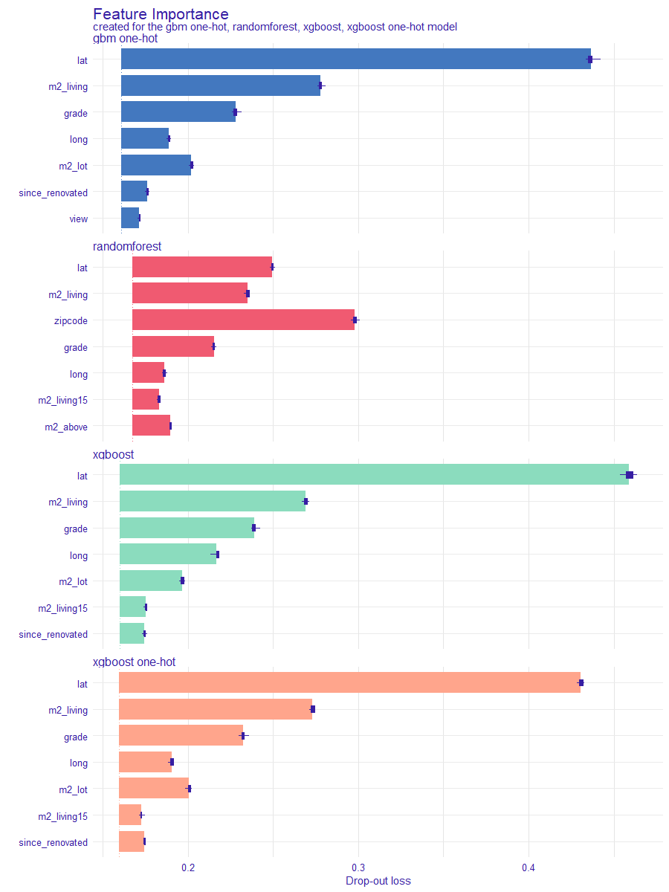
```

What we see, is that different models have different important variables. They also agree on some predictors. Is that ok? Yes, these are different models and they approach fitting to the train data differently. Is it that why we should trust them? Not now. Let's take a closer look.

### Partial Dependence Plots

They all agree at `lat` and `long` which is latitude and logitude (basic knowledge might be memorization resistant: longitude describes _horizontal (W-E)_ position, latitude the _vertical (N-S)_ position). 

```{r latlong, out.width="700", fig.align="center", echo=FALSE, fig.cap='PDP curves for 4 models. We clearly see that prices go much higher in the city center.'}
knitr:::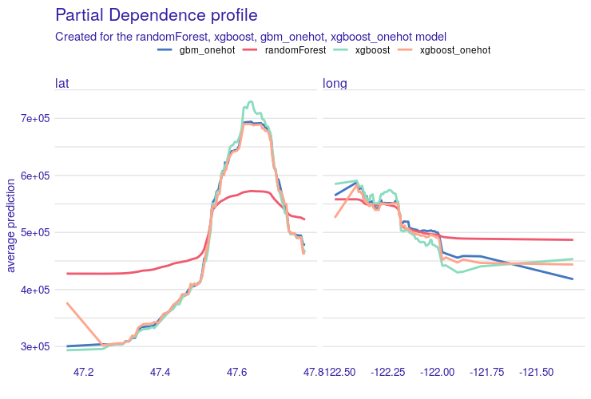
```

Second variable worth investigation is `m2_living`, house surface in square meters. What we expect is more or less linear increase. And so it is. With `grade` we also expected increasing curves, but not especially linear. What is interesting, price goes much higher, if the grade changes from 5-6 to 8-9. We will discuss this phenomenon later in details.

```{r m2_grade, out.width="700", fig.align="center", echo=FALSE, fig.cap='PDP curves for surface and grade. Looks like Random Forest again pulls more towards the center.'}
knitr:::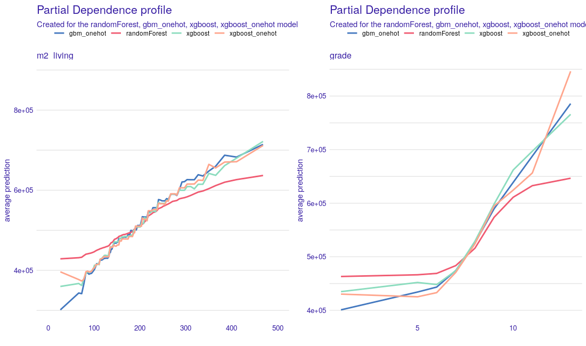
```

 

Going on to `zipcode`. For random forest it is quite crucial, so let's take a closer look. This time, to compare all four models, we need another approach, since two of them are one-hot encoded on this variable: we generated all PDP plots and looked at all of the pairs for `xgboost_onehot` and `gbm_onehot` for every `zipcode`. Since there are far too many of them, we decided to show only the interesting ones. It turns out, that at most pairs they agree, but not at all of them. As an example, let's take a look at zipcodes 98010, 98106 and 98018 in the picture \@ref(fig:pdp_zipcodes) and \@ref(fig:map) -- we found them on the map. 


```{r pdp_zipcode, out.width="700", fig.align="center", echo=FALSE, fig.cap='PDP curves for zipcodes. This time random forest goes sensitive.'}
knitr:::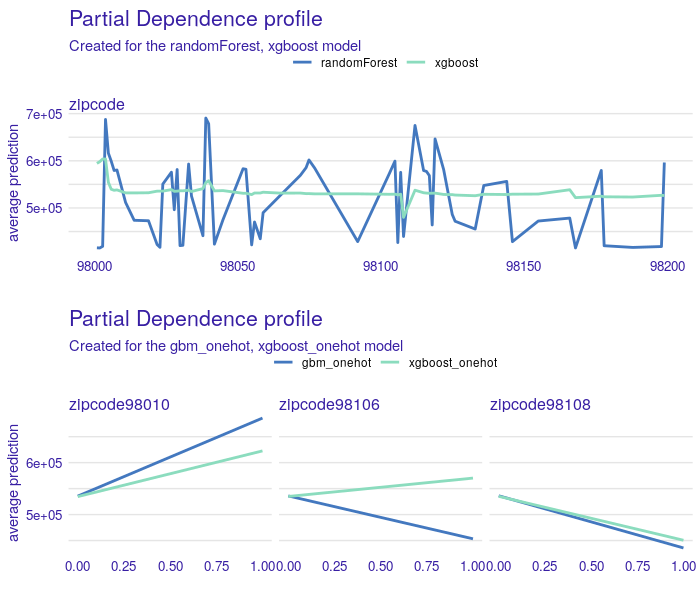
```

```{r map, out.width="700", fig.align="center", echo=FALSE, fig.cap='Zipcodes of interest on the map.'}
knitr:::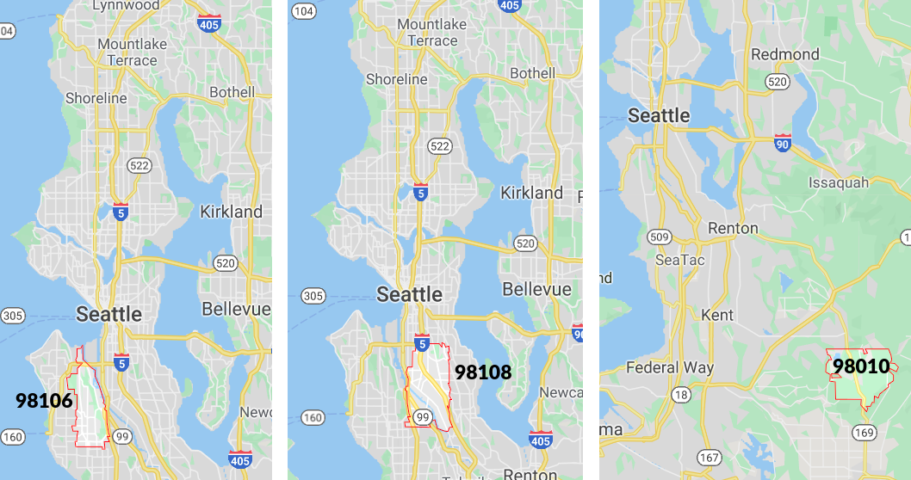
```

After a little bit of investigation victims reveal: in area 98108 there is a loud airport. On the other hand 98010 is far from the city center, there is more space, so people build bigger houses. For instance, in 98010 one can easily find houses with living area of more than 300m² which is not so common in zipcodes 98106 and 98108. Remember, we were modelling (log of) the price of the whole house, not price of 1m². 


There are more examples of variables that their PDP plots fit our expectations. The problem starts with such variables as `age`, `since_renovated` (how many years have passed since building or last renovation, whichever is less). In the background we also want to look at `dist_stop`. This pair is interesting, let's take a look at \@ref(fig:age). Right plot is almost ok: freshly renovated houses are much more expensive, but we observe strange behaviour of Random Forest.
The left part is a surprise: the older the house is, the more it costs. That's strange, but it turns out, that older houses tend to be renovated. Rate of renovated houses starts to increase after houses reach 60 years. Half of a century might be a reason to do renovation for sure. To give some numbers: 11% of houses *over* 60 years old were renovated, and only 0.1% of houses *under* 40 years were renovated. What is more, `since_renovated` was more important for all of models than age. 

```{r age, out.width="700", fig.align="center", echo=FALSE, fig.cap='Age and relative age of a building.'}
knitr:::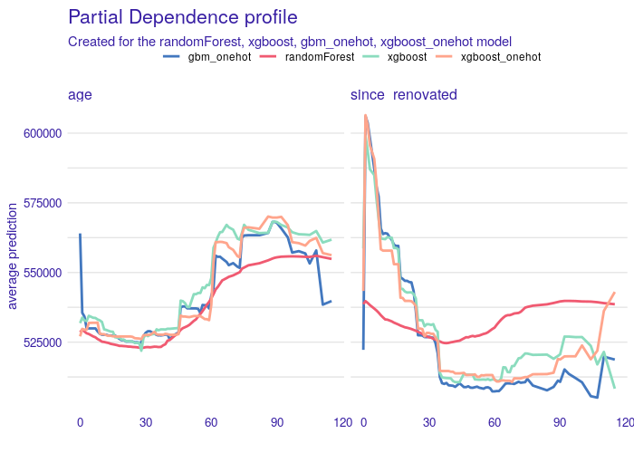
```

For distance to the nearest bus stop PDP plots are shown at \@ref(fig:stop). We've trimmed `x` axis to 2000 meters, since 92% of observations fulfill that condition. Interesting is, that the shorter distance indicates lower prediction. The overall causality of this variable is rather not that strong. 

```{r stop, out.width="700", fig.align="center", echo=FALSE, fig.cap='PDP curve for distance to the nearest bus stop.'}
knitr:::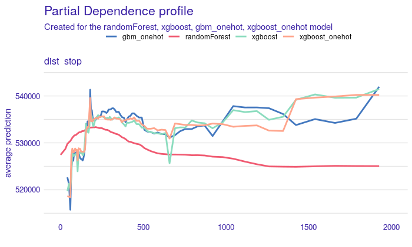
```

#### PDP summary

We've seen a lot of PDP plots. Before we move to next tools, we will draw some conclusions so far. Most of PDP plots match our expectations. But there are also variables, where Random Forest cracks, such as `since_renovated`, `condition`, `m2_lot`, `m2_lot15` to mention a couple of them. I'd guess that it put far too much attention on the zipcodes rather than other variables, which were uncorrectly estimated. That'd also explain huge difference between RMSE on train and test data, Random Forest was overfitted. Other 3 models seem to agree with each other and with so-called common sense. [All models are wrong, but Many are usefull](http://www.jmlr.org/papers/v20/18-760.html), as statisticians say. If three other models agree on variable effect, it is hard to believe that the other model, that is saying the opposite, is right. At this point, we drop Random Forest and we won't be examining this model from different perspectives.

At this point we also compare two one-hot encoded models, XGBoost and GBM. Their plots are almost identical and they match the XGBoost model without one-hot encoding. So among all 3 we might choose the one with best score, which is XGBoost. 

So far we have discussed a lot of model-level explanations. Next subsection will focus more on instance-level contemplations.


### Instance level explanations. 

This subsection focuses on explaining particular houses. It is definitely not clear which observations should be examined. In previous subsection we tried PDP plots to check if we can trust the model and it worked out well.
Here we will start with looking at:

* houses with high misprediction and
* houses with highest average price for 1 square meter

hoping it will be meaningful. Note, error is measured linearly on the log-scale, so after the reverse transofmation we look for real estates that had high realtive misprediction. 

What is more, in earlier analysis, among others we were considering zipcodes 98010, a quiet area of Black Diamond with Lake Sawyer. To this list we add zipcode 98039, which is Medina -- mostly residential city. Villas there are vast: 56% of them have at least 300m². Reason is that we want to analyse significantly larger houses in their natural enviroment. 

Because we don't want the reader to get bored and waste a lot of space and reading time, we present most interesting observations in those zipcodes also remembering to cover all of the items on our list above. 


Let's begin with zipcode 98010. Here we present a property that was the second expensive one. We decided to examine this one, instead of the most expensive one, because it had greater error and the first one we couldn't locate on Google Street View. This house built 23 years ago is high grade, has 300 square meters surface and large garden of 2000 square meters. Predicted value is 667 k\$, while true value is 902.5 k\$. Break-Down plot for this estate is presented in \@ref{fig:h_98010}. 


```{r h_98010, out.width="700", fig.align="center", echo=FALSE, fig.cap='BD plot for hugely mispredicted house. It looses a lot of value because of its geographical position (far from Seattle), but gains a lot on grade and surface.'}
knitr:::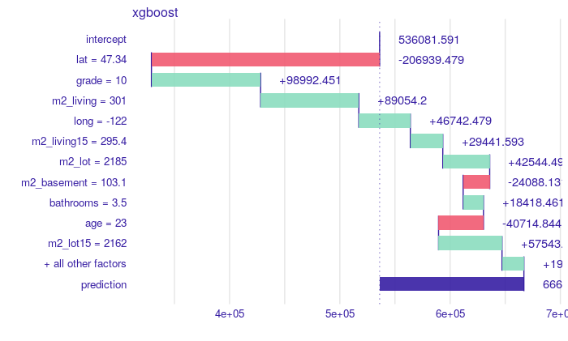
```

As we can find up on a map, this particular property actually *has* acces to the lake and should had been marked with `waterfront = 1`. If it had, the prediction would be  787325 k\$, according to the XGBoost model, and that halves the relative error. From the picture \@ref{fig:h_98010} we could also conclude, that houses with `waterfront = 0` are not loosing so much, but they would highly gain when `waterfront` would be equal to 1. Another conclusion is that there are mistakes in the data frame.

Next case is a house in Medina. We chose the one with highest average price for 1 square meter of the building. In the figure \@ref(fig:h_98039) we see Break Down plot for this house. All factors are in favor of this house. It is in good location, top grade, living surface is enormous, it has beautiful view, acces to the Lake Washington, neighborhood is wealthy. Predicted value is 3,961k\$, while true value was 3,640k\$. Interesting and counter intuitive is, that one variable has negative effect, and that is `floors`. This particular house has 2 levels. In the same picture we also plot CP profile for this variable, which says that having two floors is actually the best choice for this observation. 

```{r h_98039, out.width="800", fig.align="center", echo=FALSE, fig.cap='BD plot for a villa in 98038 zipcode.'}
knitr:::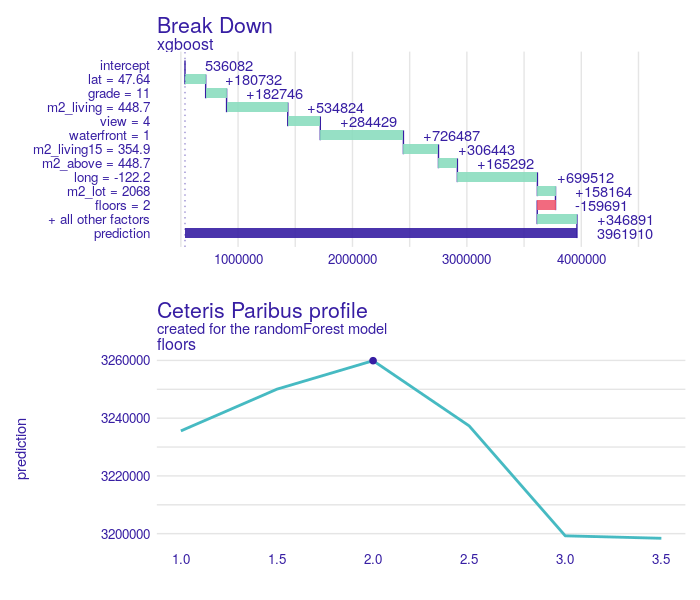
```


## Use case of the model

Przykład użycia modelu do znajdowania mieszkań, na których można wiele zyskać robiąc remont (`grade` rośnie z <5 na >8 (z pdp), `since_renovated` = 1)


## Summary and conclusions 

Here add the most important conclusions related to the XAI analysis.
What did you learn? 
Where were the biggest difficulties?
What else did you recommend?

