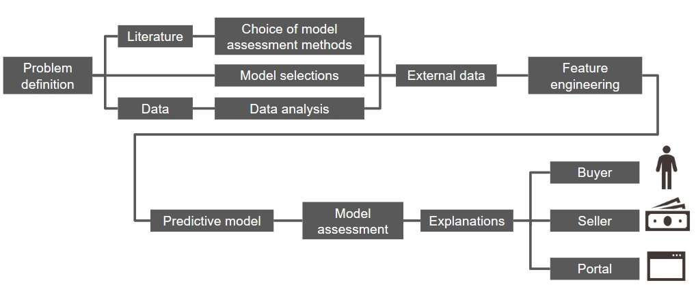

# Story House Sale Prices: eXplainable predictions for for house sale {#story-house_sale_prices}

*Authors: Piotr Grązka (SGH Warsaw School of Economics), Anna Kozak (Warsaw University of Technology), Paweł Wicherek (Warsaw University of Technology)*

*Mentors: Mateusz Zawisza (McKinsey & Company), Adam Zmaczyński (McKinsey & Company)*

## Introduction 

Put a description of the problem here. indicate the data source. Describe why this problem is important. Indicate the most important literature on the problem.

Problem nad którym pracujemy jest naprawdę ważny, w pewnym momencie swojego życia będzie się z nim borykać większość ludzi. Mówimy tutaj o kupnie/sprzedaży nieruchomości. Dodatkowo tak postawiony probelm ma też zastosowanie kompercyjne ze względu na deweloperów lub portale aukcyjne. Rozpoczynając prace postawmy kilka pytań, które pozwolą nam przedstawić ten probelm:
	Sprzedający nie wie jak podnieść koszt mieszkania tak, żeby nakłady inwestycyjne były niższe niż wartości dodane (dokupienie piwnicy podniesie ceną, a remont łazienki się nie opłaca)
	Sprzedający nie wie za ile sprzedać mieszkanie (wystawia oferę na portalu i nie wie czy cena jest uczciwa)
	Kupujący nie wie ile jest warte dane mieszkanie (podobnie jak wyżej, czy cena jest uczciwa)
	Komercyjny problem: Serwisy aukcyjne nie mają narzędzi wspierających sprzedających/kupujących. 


Przegląd literatury
Zbiór danych 
	This dataset contains house sale prices for King County, which includes Seattle. It includes homes sold between May 2014 and May 2015.
plan działania
= obazek z podziałem na kupujacy/sprzedajacy i prortal.


```{r cover, cache=FALSE, out.width="700", fig.align="center", echo=FALSE}

```


## Model 

Place a description of the model(s) here. Focus on key information on the design and quality of the model(s) developed.

## Explanations

Here, show how XAI techniques can be used to solve the problem.
Will dataset specific or instance specific techniques help more?

Will XAI be useful before (pre), during (in) or after (post) modeling?

What is interesting to learn from the XAI analysis?


## Summary and conclusions 

Here add the most important conclusions related to the XAI analysis.
What did you learn? 
Where were the biggest difficulties?
What else did you recommend?

